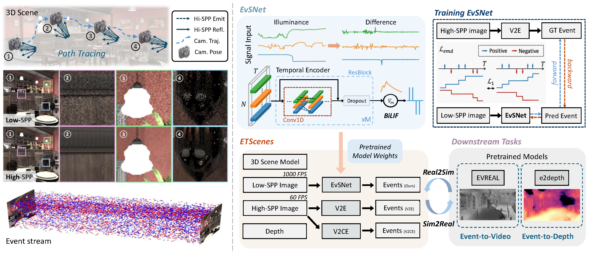

# EventTracer
### [[Project]](https://lagrangeli.github.io/EventTracer-simulator/) [[Paper]](https://www.computer.org/csdl/journal/tg/5555/01/11553408/2h9GzibPmRW)

> [**EventTracer: Fast Path Tracing-Based Event Stream Rendering**](),            
> [Zhenyang Li](https://lagrangeli.github.io/)\*, [Xiaoyang Bai](https://andrewbxy.github.io/)\*, [Jinfan Lu](https://github.com/LJFYC007), [Pengfei Shen](https://jerry-shen0527.github.io/), [Edmund Y. Lam](https://eee.hku.hk/~elam/), [Yifan Peng](https://www.eee.hku.hk/~evanpeng/)  
> **IEEE TVCG 2026**

**Official code repository of "EventTracer: Fast Path Tracing-based Event Stream Rendering" (IEEE TVCG 2026).**

## Pipeline
<div align="center">
  
</div><br/>


## Get started
### Installation
Follow the instruction below to set up the environment.

```bash
# clone the repo
git clone -b main --single-branch https://github.com/andrewbxy/EventTracer.git
# create conda environment
conda create -n eventtracer python=3.10
conda activate eventtracer

pip install torch==2.5.1 torchvision==0.20.1 torchaudio==2.5.1 --index-url https://download.pytorch.org/whl/cu118
# install other denpendencies
pip install -r requirements.txt
```

### Using EvSNet
We have provided our trained checkpoint and the corresponding ONNX file, which are used to obtain all results reported in the paper, in `evsnet_our`.

*TODO: instruction on Falcor integration and event stream rendering.*

### Using ETScenes
If you simply want to use the high temporal resolution ETScenes dataset, you may download it from [here](https://huggingface.co/datasets/andrewbxy/ETScenes). Under each directory (except for `EvSNet-training`, which contains training data for EvSNet), there are several `.npz` files containing event streams simulated with different tools, and an `images` folder which contains the reference low-FPS RGB images.

## Training Your Own Model
### Training with ETScenes
You may download our training data of EvSNet from [here](https://huggingface.co/datasets/andrewbxy/ETScenes). Specifically, the `EvSNet-training` directory contains paired RGB-event data from 6 scenes, where `${scene_name}_64SPP_images` stores low-SPP RGB images (input to EvSNet) and `${scene_name}_2048SPP_events` stores high-SPP simulated event streams (GT for training EvSNet). You should replace `data_dirs` in `train.py` by the actual paths to each scene, and then you can train EvSNet by simply running
```python
python train.py --expname "${exp_name}"
```

### Training with Custom Data
*TODO: instruction on rendering RGB images with Falcor, event simulation with v2e and data processing.*

## Acknowledgement

The authors thank Dr. [Shijie Lin](https://sj-lin.top/) for fruitful discussions.

## 📜 BibTeX
```bibtex
@article{li2026eventtracer,
  title={EventTracer: Fast Path Tracing-based Event Stream Rendering},
  author={Li, Zhenyang and Bai, Xiaoyang and Lu, Jinfan and Shen, Pengfei and Lam, Edmund Y. and Peng, Yifan},
  journal={IEEE Transactions on Visualization and Computer Graphics},
  pages={1--13},
  year={2026},
  doi={10.1109/TVCG.2026.3701141}
}
```